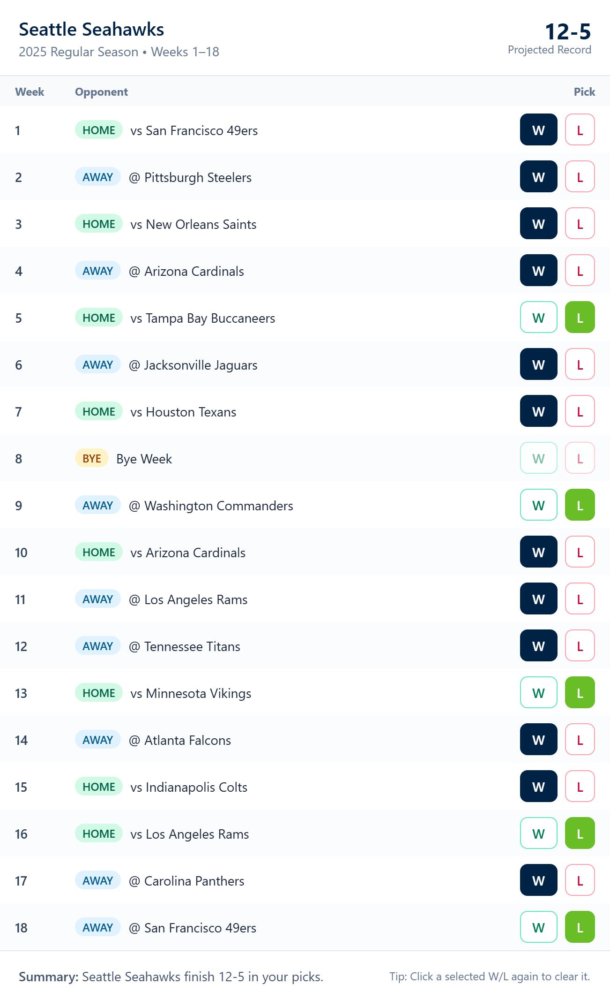

# 🏈 NFL 2025 Record Predictor

[](https://react.dev/)
[](https://vitejs.dev/)
[](https://tailwindcss.com/)
[](./LICENSE)
[](https://ParkerW98.github.io/nfl-records)

A simple React + Tailwind web app that lets you predict every NFL team’s record for the **2025 season**.
Pick wins/losses for each week, and the app automatically tallies the projected record.
You can also save your predictions as an image and share them with friends.

## 📸 Screenshot


<p align="left">
  
</p>


## ✨ Features

* Select any NFL team and view their full 2025 schedule
* Click **W/L** for each week to make your prediction
* Auto-updates projected record in real time
* Save your prediction card as a **shareable PNG**
* Built with **React, Vite, and TailwindCSS**

## ⚙️ Setup

Clone the repo and install dependencies:

```bash
git clone https://github.com/ParkerW98/nfl-records.git
cd nfl-records
npm install
```

Run locally:

```bash
npm run dev
```

Build for production:

```bash
npm run build
```

Preview build:

```bash
npm run preview
```

## 🌐 Deployment

This project is deployed with **GitHub Pages** 👉 [https://ParkerW98.github.io/nfl-records](https://ParkerW98.github.io/nfl-records)

## 📜 License

This project is for **educational and personal use only**.
Not affiliated with the NFL — team names and logos are trademarks of their respective owners.

## 👤 Author

Built by [ParkerW98](https://github.com/ParkerW98)
